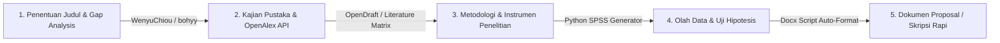

# 🎓 Repositori Tools, AI Skills & Pustaka Riset Akademis Terbaik di GitHub

Kompilasi repositori GitHub open-source terbaik yang dirancang khusus untuk membantu **penelitian akademik**, **penyusunan proposal skripsi**, **kajian literatur (Literature Review)**, hingga **penulisan tesis/disertasi**.

---

## 🛠️ 1. Pustaka AI Skills & Skill Packs (Agentic Research)

Repositori ini berisi pustaka "Skill" yang siap diintegrasikan ke dalam agen AI (seperti Claude Code, Antigravity, atau Agentic Workflows) untuk mengotomatisasi riset secara modular:

* 🔬 **[WenyuChiou/ai-research-skills](https://github.com/WenyuChiou/ai-research-skills)**
  * **Fokus**: Katalog AI Skill untuk alur riset penuh.
  * **Fitur Utama**: Analisis kelayakan topik (*Feasibility Analysis*), penentuan keterbaruan (*Research Gap / Novelty Check*), perancangan matriks literatur, dan drafting bab penelitian.

* 🧠 **[Orchestra-Research/AI-Research-SKILLs](https://github.com/Orchestra-Research/AI-Research-SKILLs)**
  * **Fokus**: Pustaka 98+ AI Skills tingkat lanjut untuk Agen Riset Otonom.
  * **Fitur Utama**: Ideasi hipotesis, otomatisasi pencarian sitasi, pemrosesan eksperimen data, hingga penyusunan naskah berstandar jurnal bereputasi.

* 📝 **[Master-cai/Research-Paper-Writing-Skills](https://github.com/Master-cai/Research-Paper-Writing-Skills)**
  * **Fokus**: Pustaka skill khusus penulisan & pemulusan paragraf akademik.
  * **Fitur Utama**: Evaluasi alur logika antar-paragraf, pengecekan kesesuaian antara klaim dan bukti (*claim-evidence alignment*), serta penyesuaian gaya bahasa ilmiah formal.

---

## 🚀 2. Engine Riset Otonom & Penulisan Tesis

* 📄 **[federicodeponte/opendraft](https://github.com/federicodeponte/opendraft)**
  * **Fokus**: Engine Python berbasis 19 AI Agent untuk menyusun draf makalah 10.000–20.000 kata.
  * **Keunggulan**: Mengintegrasikan pencarian sitasi resmi secara real-time dari *OpenAlex*, *CrossRef*, dan *arXiv* sehingga sitasi bebas dari halusinasi.

* ✍️ **[K-Dense-AI/claude-scientific-writer](https://github.com/K-Dense-AI/claude-scientific-writer)**
  * **Fokus**: Alat *Deep Research* dan penyusunan naskah ilmiah tingkat lanjut berbasis sitasi terverifikasi.

---

## 📚 3. Repositori Prompt Engineering Akademik & Skripsi

* 💡 **[bohyy/academic-ai-prompt](https://github.com/bohyy/academic-ai-prompt)**
  * **Fokus**: Koleksi 40+ prompt sistematis untuk tugas akademik.
  * **Cakupan**: Formulasi rumusan masalah, pembuatan Latar Belakang Masalah (Bab 1), perancangan metode kuantitatif/kualitatif (Bab 3), dan sintesis telaah pustaka (Bab 2).

* ✍️ **[ahmetbersoz/chatgpt-prompts-for-academic-writing](https://github.com/ahmetbersoz/chatgpt-prompts-for-academic-writing)**
  * **Fokus**: Prompt khusus pemolesan tata bahasa, *academic tone*, paraphrasing untuk menurunkan skor plagiasi Turnitin, dan penyusunan abstrak.

* 📖 **[dair-ai/Prompt-Engineering-Guide](https://github.com/dair-ai/Prompt-Engineering-Guide)**
  * **Fokus**: Standar global *Prompt Engineering* (Chain-of-Thought, ReAct, Tree-of-Thoughts) untuk memastikan AI berpikir secara logis tanpa kesalahan kognitif.

---

## 🌟 4. Koleksi "Awesome" & Direktori Alat Riset Akademis

* 📌 **[0x11c11e/awesome-ai-research-tools](https://github.com/0x11c11e/awesome-ai-research-tools)**
  * **Fokus**: Kurasi alat AI teruji untuk discovery artikel ilmiah, analisis keterkaitan sitasi (citation mapping), dan pengorganisasian referensi.

* 🏷️ **[GitHub Topic: academic-research-tools](https://github.com/topics/academic-research-tools)**
  * **Fokus**: Komunitas open-source yang mengembangkan skrip pencarian makalah, integrasi Zotero/Mendeley, dan automasi skripsi.

---

## 🔄 5. Rekomendasi Alur Kerja (Workflow Sinergi di Workspace Antigravity)

1. **Tahap 1 (Judul & Gap Analysis)**: Gunakan prompt dari `bohyy/academic-ai-prompt` untuk memastikan rumusan masalah tajam dan relevan.
2. **Tahap 2 (Kajian Pustaka)**: Gunakan referensi terverifikasi via CrossRef / OpenAlex untuk menyusun Bab 2 tanpa halusinasi rujukan.
3. **Tahap 3 (Metodologi)**: Rancang sampel, populasi, dan instrumen tes di Bab 3.
4. **Tahap 4 (Olah Data)**: Manfaatkan script `generate_spss_data.py` untuk menghasilkan data mentah SPSS & pengujian hipotesis (t-test / ANOVA).
5. **Tahap 5 (Auto-Formatter)**: Jalankan script `generate_proposal_skripsi_docx.py` untuk mengompilasi draf menjadi berkas Word `.docx` yang 100% rapi dan presisi sesuai format Universitas Nurul Huda.
