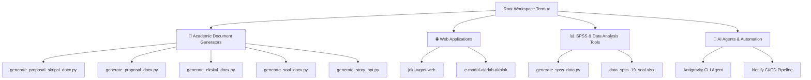

# 📚 Repositori Workflow Akademik & AI Agents

Dokumentasi komprehensif ini merangkum seluruh arsitektur repositori, alur kerja akademik (*Academic Workflow*), generator dokumen otomatis, aplikasi web interaktif, dan agen AI yang dikembangkan di dalam ruang kerja ini.

---

## 🏛️ Arsitektur Utuh Ruang Kerja (Workspace)

---

## 📂 1. Generator Berkas Akademik Otomatis (Python Scripts)

Seluruh berkas dokumen (`.docx`) dan presentasi (`.pptx`) dibangun secara otomatis menggunakan *scripting python* berbasis `python-docx` dan `python-pptx` dengan standar tata letak resmi perguruan tinggi dan sekolah.

| Berkas Script | Deskripsi & Hasil Dokumen | Output Path |
| :--- | :--- | :--- |
| `generate_proposal_skripsi_docx.py` | Generator Proposal Skripsi PAI (Format Resmi Univ. Nurul Huda) lengkap dengan Cover, Logo, Lembar Pengesahan (Dekan, Kaprodi, Pembimbing I Dr. Romdloni, M.Pd.I), Abstrak, Daftar Isi *Dot Leader*, Bab I-III & Daftar Pustaka. | `/storage/emulated/0/Download/Proposal_Skripsi_PAI_Hoerul_Anam.docx` |
| `generate_proposal_docx.py` | Generator Proposal Pembangunan Jembatan Usaha Tani lengkap dengan rancangan anggaran dan latar belakang pembangunan infrastruktur. | `/data/data/com.termux/files/home/project/Proposal_Pembangunan_Jembatan_Usaha_Tani.docx` |
| `generate_ekskul_docx.py` | Generator Laporan Capaian Hasil Ekstrakurikuler Tahun 2026 dilengkapi integrasi grafik statistik Matplotlib. | `/data/data/com.termux/files/home/Capaian_Hasil_Ekstrakurikuler_Tahun_2026.docx` |
| `generate_soal_docx.py` | Generator Naskah Soal Pretest & Posttest Literasi Sains ISETS Materi Pesawat Sederhana. | `/data/data/com.termux/files/home/Soal_Pretest_Posttest_Literasi_Sains_ISETS_Pesawat_Sederhana.docx` |
| `generate_ski_story_docx.py` | Generator Cerita/Dongeng Pembelajaran SKI (*Kisah Pasukan Gajah & Ababil*). | `/data/data/com.termux/files/home/Kisah_Pasukan_Gajah_dan_Ababil_SKI.docx` |
| `generate_story_ppt.py` | Generator Slide Presentasi PPTX Interaktif (*Kisah Pasukan Gajah & Ababil*). | `/data/data/com.termux/files/home/Kisah_Pasukan_Gajah_dan_Ababil_PPT_Dongeng.pptx` |

---

## 🌐 2. Aplikasi Web Interaktif (Frontend & Deployment)

### A. **TugasBeres Web (`joki-tugas-web`)**
* **Teknologi**: HTML5, CSS3 Glassmorphism, Vanilla JavaScript, Supabase Client JS.
* **Database Backend**: PostgreSQL via **Supabase Database** (Tabel `orders`, `plagiarism_scans`, `testimonials`).
* **Fitur Utama**:
  * Landing Page Jasa Akademik Terintegrasi.
  * **Kalkulator Tarif Otomatis**: Mendukung estimasi biaya Proposal Skripsi & Tugas Akhir (Bab 1-5), SPSS, PPT, E-Modul, Esai, dan Makalah.
  * **Penyimpanan Pesanan Database**: Menyimpan riwayat pemesanan secara otomatis ke Supabase.
  * **Tools Cek Plagiarisme & Log Database**: Visualisasi *score circle*, highlight kalimat terdeteksi, logging riwayat pengecekan ke Supabase, dan konsultasi order *paraphrase* via WhatsApp.
* **Deployment & Hosting**: Terintegrasi CI/CD **Netlify** (File `netlify.toml`) di [https://tugas-beres.netlify.app/](https://tugas-beres.netlify.app/).

### B. **E-Modul Akidah Akhlak (`e-modul-akidah-akhlak`)**
* **Teknologi**: Vite + React 19 + Lucide Icons + Supabase SDK.
* **Database Backend**: **Supabase Database** (Tabel `quiz_results`).
* **Deployment**: Hosting **Netlify** dengan konfig SPA redirect & build script.

---

## 📊 3. Perangkat Olah Data Statistik (SPSS & Data Mining)

* **`generate_spss_data.py`**: Membangun dataset simulasi jawaban pilihan ganda (19 soal / 14 soal), skor total, serta format `.xlsx` dan `.csv` yang siap diimpor (*Import Ready*) ke IBM SPSS Statistics.
* **`panduan_data_spss.md`**: Panduan langkah demi langkah uji validitas, uji reliabilitas Cronbach's Alpha, uji normalitas Kolmogorov-Smirnov, dan uji Independent Sample t-Test.

---

## 🤖 4. Integrasi AI Agents & Workflow Automation

Repositori ini dikendalikan oleh agen AI pintar (**Antigravity CLI Agent**) yang mengeksekusi otomatisasi tugas:
1. **Verifikasi & Build Pipeline**: Menguji kelayakan sintaksis Python, kompilasi React Vite, dan pengujian commit Git secara otomatis.
2. **Standardisasi Format Akademik**: Memastikan seluruh margin, font (*Times New Roman 12pt / 14pt*), tab stop dot leader, dan lembar pengesahan mengikuti pedoman resmi kampus tanpa perlu penataan manual.
3. **Penyimpanan Multi-Lokasi**: Menyimpan otomatis berkas hasil ke memori internal smartphone (`/storage/emulated/0/Download`) dan workspace lokal.

> [!NOTE]
> Repositori ini terus diperbarui secara dinamis untuk mendukung efisiensi pengerjaan karya ilmiah, penelitian akademik, dan pengembangan media pembelajaran digital.
